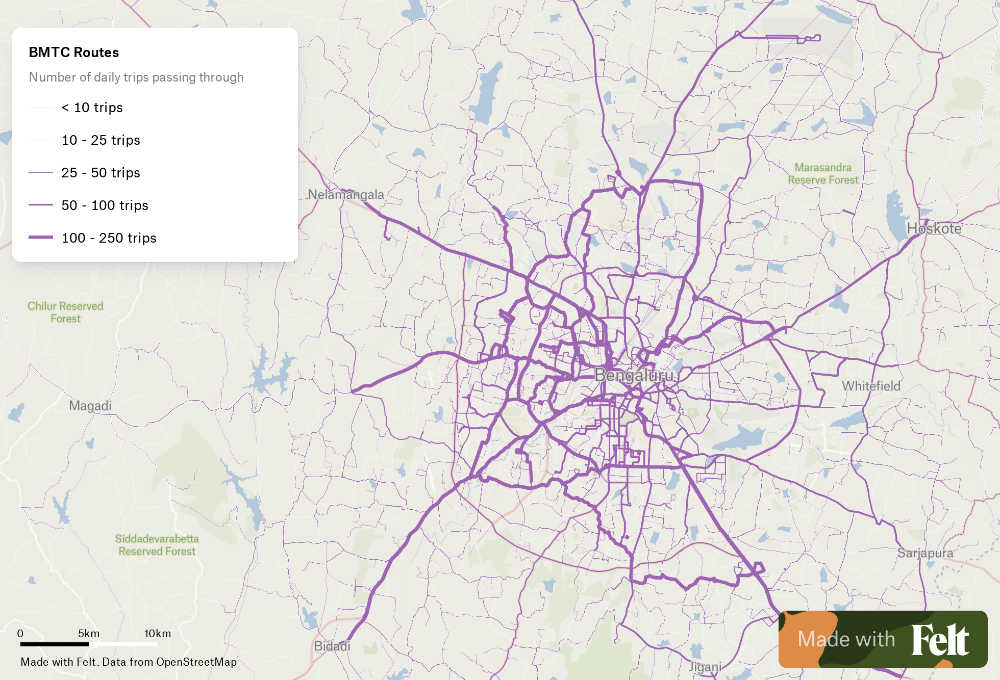
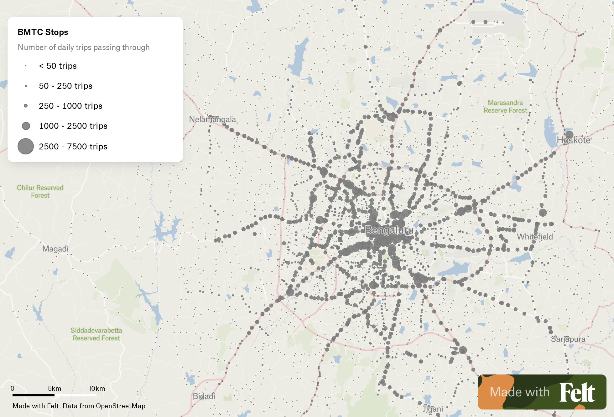
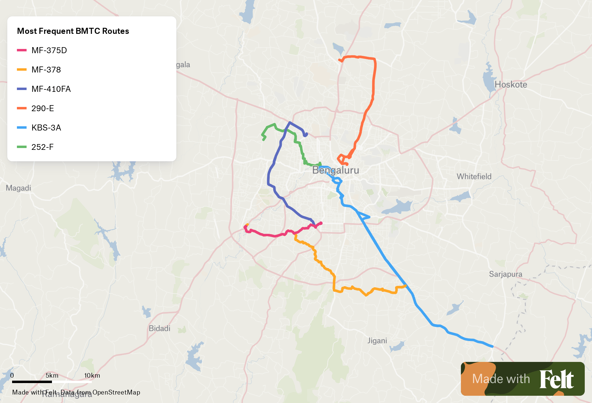
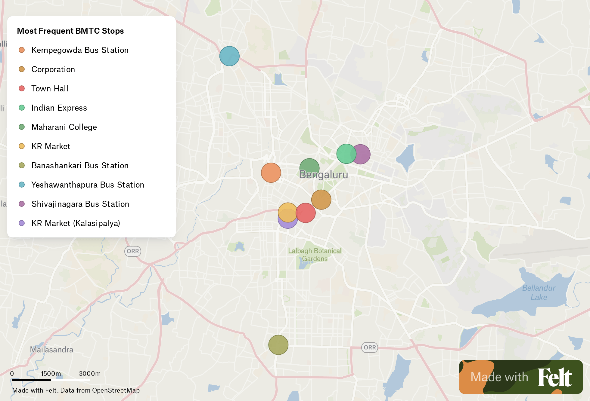

# bmtc-gtfs

Unofficial GTFS dataset for BMTC routes, stops and timetables in Bengaluru. Raw data sourced from Namma BMTC app, parsed and saved as GTFS.

## Motivation

- [Why BMTC?](https://datameet.org/2016/08/05/bmtc-intelligent-transportation-system-its-open-transport-data/)
- [Why GTFS?](https://gtfs.org/#why-use-gtfs)

## Caveat

The source for the data and analysis in this repository are the routes, stops and timetables as displayed on the Namma BMTC app. However, the Namma BMTC app is not completely accurate, and is particularly unreliable for timetables and stop timings. Nonetheless, the data can be used to understand general trends in the BMTC network.

Due to the design of the Namma BMTC app, only routes with functional live tracking are included in the GTFS. Any missing routes may be due to live tracking unavailability and not necessarily due to the route being inoperational.

## GTFS

The GTFS dataset can be found **[here](gtfs/bmtc.zip?raw=1)**

## Maps

### Route frequency

*Route frequency - number of daily trips passing through a given route. [View interactive map](https://felt.com/map/BMTC-Routes-January-2024-tmH9CPE9AsQmaAIqpwyh9AkdC?loc=13.00,77.50,11z)*

### Stop frequency

*Stop frequency - number of daily trips passing through a given stop. [View interactive map](https://felt.com/map/BMTC-Stops-January-2024-r1xBsx0DSxu67ij4v36cSC?loc=13.00,77.50,11z)*

### Most frequent route

*Most frequent routes - MF-375D (434 trips), MF-378 (393 trips), MF-410FA (319 trips), 290-E (306 trips), KBS-3A (293 trips). [View interactive map](https://felt.com/map/Most-Frequent-BMTC-Routes-xc2XS9BtXRFCpqEQBS3REjC?loc=12.9417,77.5444,10.98z)*

### Most frequent stop

*Most frequent stops - KBS (12520 trips), Corporation (7376 trips), Town Hall (4631 trips), Indian Express (4268 trips), Maharani College (4187 trips). [View interactive map](https://felt.com/map/Most-Frequent-BMTC-Stops-x3iatTZpSKGCdZGG9ClzZMB?loc=12.96784,77.57994,12.68z)*

## GeoJSON

GeoJSONs can be found below:
- [Routes](geojson/routes.geojson?raw=1)
- [Stops](geojson/stops.geojson?raw=1)
- [Aggregated Stops](geojson/aggregated.geojson?raw=1)

Conversion into other formats can be done using free tools like [mapshaper](https://mapshaper.org/) or [QGIS](https://qgis.org/en/site/)

## CSV

CSVs can be found below:
- [Routes](csv/routes.csv?raw=1) (or explore [here](https://flatgithub.com/Vonter/bmtc-gtfs?filename=csv/routes.csv&stickyColumnName=name&sort=trip_count%2Cdesc))
- [Stops](csv/stops.csv?raw=1) (or explore [here](https://flatgithub.com/Vonter/bmtc-gtfs?filename=csv/stops.csv&stickyColumnName=name&sort=trip_count%2Cdesc))
- [Aggregated Stops](csv/aggregated.csv?raw=1) (or explore [here](https://flatgithub.com/Vonter/bmtc-gtfs?filename=csv/aggregated.csv&stickyColumnName=name&sort=trip_count%2Cdesc))

## HTML

Visualize the routes, stops and timetables in the GTFS dataset, with a web browser: **[https://bmtc-gtfs.netlify.app](https://bmtc-gtfs.netlify.app)**

## Validations

- [gtfs-validator](validation/gtfs-validator)
- [gtfsvtor](validation/gtfsvtor)
- [transport-validator](validation/transport-validator) (Older versions of GTFS)

## Scripts

- [scrape.py](scripts/scrape.py): Scrape raw data from Namma BMTC
- [gtfs.py](scripts/gtfs.py): Parse raw data and save as GTFS
- [valiate.py](scripts/validate.py): Pass the GTFS through multiple GTFS validation tools
- [analysis.py](scripts/analysis.py): Process the GTFS and output a GeoJSON representing the network

## Raw JSON

Raw JSON data scraped from Namma BMTC can be found below:

- [routelines.zip](raw/routelines.zip?raw=1): Pointwise co-ordinates of each route
- [stops.zip](raw/stops.zip?raw=1): Stops through which each route passes
- [timetables.zip](raw/timetables.zip?raw=1): Timetables for each route
- [fares.zip](raw/fares.zip?raw=1): Fares for each route and stop-pair
- [translations.zip](raw/translations.zip?raw=1): Kannada names for each stop

## To-do

- Scripts and data
    - Fix validation errors and warnings
    - Fix missing/failed routes/stops/timetables/fare information
    - Optimize fetch scripts to minimize network call
    - Optimize parse scripts to speed up data processing
    - GitHub Actions workflow for automatic GTFS data updates
    - Regularly scheduled GitHub Actions workflow for daily GTFS data updates
- Analysis and visualizations
    - HTML timetables
    - PDF timetables
    - [Route series-wise maps](https://github.com/geohacker/bmtc#2-and-3-series-routes)
    - [Directionality](https://github.com/geohacker/bmtc#direction)
    - [Reachability](https://github.com/geohacker/bmtc#reachability)
    - [Redundancy](https://github.com/geohacker/bmtc#redundancy)
    - [Access to amenities](https://github.com/geohacker/bmtc#school-walkability) (education, health, recreation, employment)

## Contributing

Interested in contributing or want to know more? Join the [bengwalk Discord Server](https://discord.com/invite/Sdkhu5MYnA)

## Credits

- [Namma BMTC](https://bmtcwebportal.amnex.com/commuter/dashboard)
- [transitfeed](https://github.com/google/transitfeed)
- [gtfstidy](https://github.com/patrickbr/gtfstidy)
- [gtfs-validator](https://github.com/MobilityData/gtfs-validator)
- [gtfsvtor](https://github.com/mecatran/gtfsvtor)
- [transport-validator](https://github.com/etalab/transport-validator)
- [gtfs_kit](https://github.com/mrcagney/gtfs_kit)

## Inspiration

- [geohacker](https://github.com/geohacker/bmtc)
- [planemad](https://bitterscotch.wordpress.com/tag/chennai-bus-map/)
- [nikhilvj](http://nikhilvj.co.in/files/bmtc-gtfs/)
- [openbangalore](https://dataspace.mobi/dataset/bengaluru-public-transport-gtfs-static)
- [mauryam](https://github.com/mauryam/gtfs-data)
